# SSH 접속 및 Python 실행하기

R 사용자는 Step1-3을 숙지한 뒤 [R 문서](./2025-03-02-r.md)로 넘어가세요.

## Step1 - terminal 앱 고르기

User는 `SSH`로 `hpc node`에 접속하여 클러스터를 사용합니다. 터미널 환경과 `vi` 에디터에 익숙한 user는 자신에게 친숙한 앱을 사용하면 됩니다. 그렇지 않은 경우 `Visual Studio Code`를 사용하는 것을 추천합니다. 이 문서에는 `Visual Studio Code`를 사용하는 것을 전제로 합니다. 추천 이유는 다음과 같습니다.

- Windows, MacOS, Linux에서 모두 사용 가능합니다.

- 터미널과 에디터, 파일 브라우저가 통합되어 있습니다.

    - 불편하게 vi나 nano등의 CLI용 텍스트 에디터를 사용할 필요가 없습니다.

    - 파일 전송시 scp등의 복잡한 프로토콜을 사용하지 않고 drag & drop으로 수행할 수 있습니다.

## Step2 - SSH 접속

`Visual Studio Code`를 설치하고 아래 안내에 따라 설정합니다.

### 1. Visual Studio Code extensions에서 Remote Development 설치

Microsoft가 제공하는 `Remote Development` extension pack을 설치합니다. WSL, Dev Containers, Remote-SSH, Remote-Tunnels가 자동적으로 같이 설치됩니다.

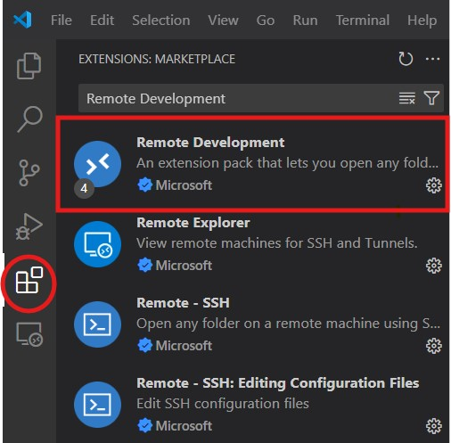

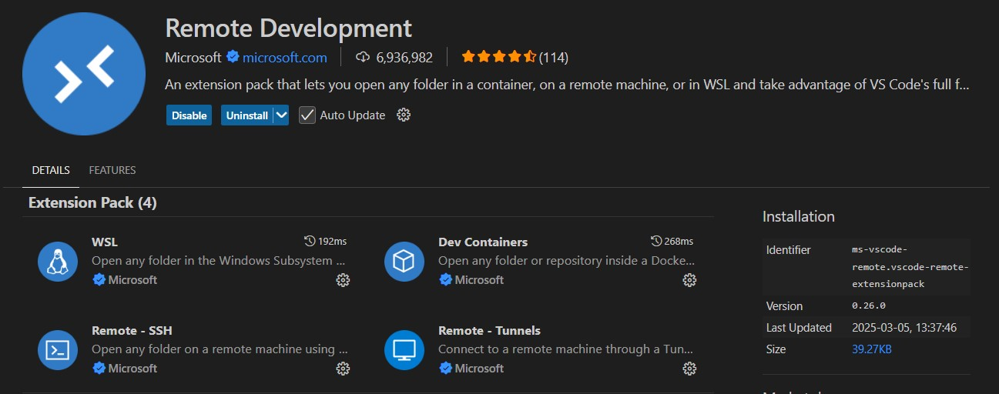

### 2. Remote Explorer에서 REMOTES(TUNNELS/SSH)를 선택 후, + 클릭

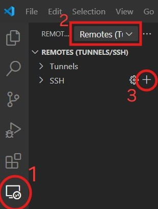

### 3. SSH 접속 커맨드 입력

아래와 같은 창이 뜨면 `SSH` 커맨드를 입력하여 `hpc node`에 접속합니다.

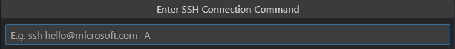

아래 커맨드에 Slack으로 안내받은 port, username, `hpc node`의 ip을 넣어서 위 창에 입력하고 `Enter`키를 누르면 됩니다. `SSH`의 default port는 `22`이지만, 저희는 보안상 이유로 다른 port를 사용합니다.

```
ssh -p [port] [username]@[ip]
```

### 4. SSH configuration file을 저장할 장소 선택

**Select SSH configuration file to update**가 나오면 맨 위 항목을 선택합니다.

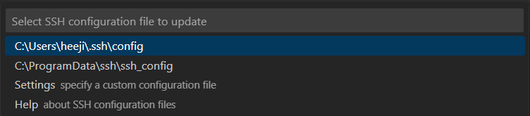

**Host added!** 라는 메시지가 우측 하단에 나옵니다.

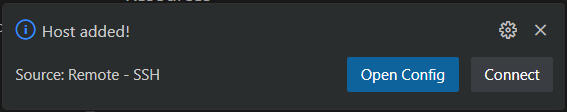

### 5. Host명 수정(선택사항)

초기 Host명이 `hpc node`의 ip주소로 설정됩니다.(xxx.xxx.xx.xx 형식) 사용자가 Host명을 명명하고 싶다면 다음 과정을 수행합니다.

Remote Explorer에서 SSH 옆 톱니바퀴를 클릭합니다.

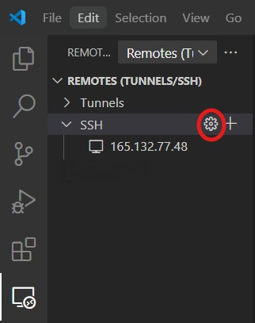

Select SSH configuration file to update가 나오면 맨 위 항목을 선택합니다.

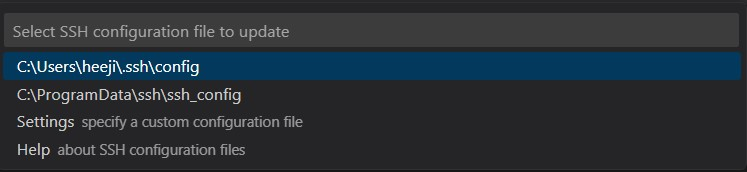

다음과 같이 config 파일이 열립니다. (아래는 ip주소와 포트번호 노출을 막기 위해 Host, HostName, Port 옆을 수정한 이미지입니다. config 파일 여시면 ip주소와 포트번호 모두 안내받으신 대로 보이는 것이 정상입니다.)

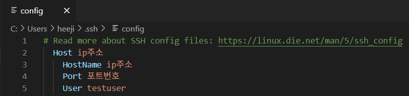

Host 옆 내용을 사용자 임의로 수정한 후 해당 config 파일을 저장합니다. 여기에서는 yonsihpc로 수정해 주었습니다. Host 옆 이외의 부분은 수정하지 않습니다.

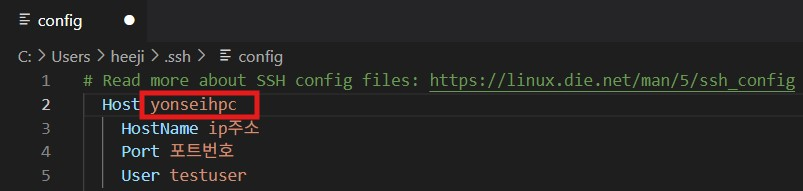

다음과 같이 Host명이 수정된 것을 Remote Explorer에서 확인할 수 있습니다.

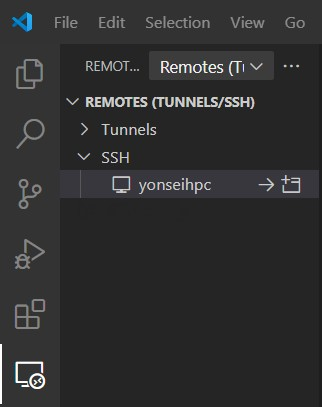

### 6. Remote Explorer에서 Connect to Host in New Window 선택

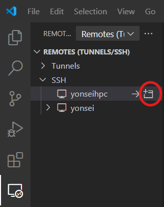

### 7. 서버 Platform 선택

**Linux**를 선택합니다.

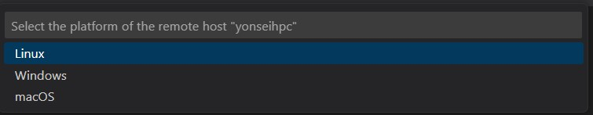

### 8. Password 입력

안내받은 password를 입력하여 로그인합니다.

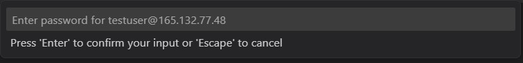

### 9. 파일 시스템 마운트

좌측 탭의 파일 모양 아이콘을 클릭하고 **Open Folder** 버튼을 클릭합니다.

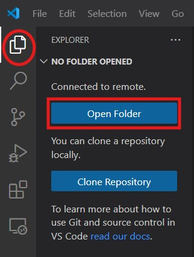

기본적으로 user home directory 경로가 입력되어 있습니다. OK를 누릅니다.

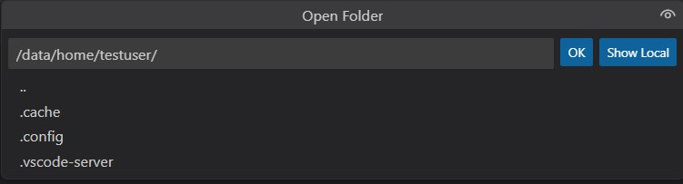

다시 password 입력창이 뜬다면, 안내받은 password를 입력합니다.


### 10. 둘러보기

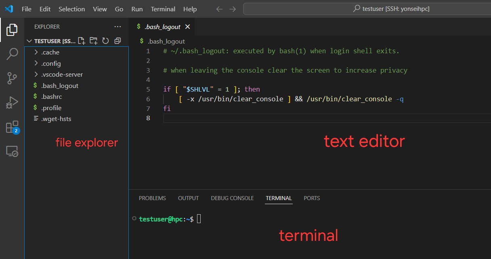

- 좌측 file explorer에서 파일을 관리합니다. Windows 탐색기나 MacOS Finder에서 drag&drop으로 파일을 옮길 수 있습니다. 클러스터 내부의 파일을 user의 local 컴퓨터로 가져오는 것도 drag&drop으로 가능합니다.

- `ctrl + shift + ~`키를 누르면 터미널이 열립니다. 여기서 서버 사용에 필요한 커맨드를 입력합니다. 터미널은 여러 개 띄울 수 있습니다.

- text editor에서 코드와 스크립트를 수정하고 이미지 파일 등을 열람합니다.

### 11. user password 변경

모든 user의 초기 password가 다 동일하기 때문에, 각 user는 첫 접속 시 password를 변경할 것을 권장합니다. 터미널에서 아래 커맨드를 입력하여 password를 변경합니다.

```
passwd
```

## Step3. 파일 시스템 구조 이해

User명은 컴퓨팅 클러스터 사용 신청시 제출하신 이메일 주소의 @ 앞 부분과 동일합니다.

`User home directory`의 prefix는 `/data/home/`입니다. 예를 들어, `dummyuser`라는 `user`의 `home directory`의 경로는 `/data/home/dummyuser/`입니다. 
다른 `user의 home directory`를 열람할 수 없도록 권한설정이 되어 있습니다. 
각 `user`는 데이터와 코드, 설정 파일 등을 자신의 `home directory` 내에 저장합니다.

- `Linux`에서 `directory`를 이동하는 명령어는 `cd`입니다.

- `home directory`를 나타내는 기호는 `~`입니다.

- 현재 `directory`를 확인하는 명령어는 `pwd`입니다.

- 파일 목록을 확인하는 명령어는 `ls`입니다.

따라서 `user`는 `hpc node`아래의 명령어를 통해 자신의 `home directory`로 이동해 그 안에 있는 파일 목록을 확인할 수 있습니다.

``` 
cd ~    
ls -a
```

```
testuser@hpc:~$ ls -a
.  ..  .bash_logout  .bashrc  .cache  .config  .profile  .vscode-server  .wget-hsts
```

## Step4. Conda environment 생성

- `hpc node`에는 conda 24.9.2이 설치되어 있으며 Python version을 3.12.7까지 지원합니다.

### Step4.1. Conda environment 생성 batch script 작성

여기서는 `hpc node`에서 `conda environment`를 생성하는 방법을 설명합니다.
`Conda environment` 생성 slurm batch script를 작성합니다. 아래는 script 예시입니다.

``` bash
#!/bin/bash
#SBATCH --nodes=1
#SBATCH --time=99:59:59
#SBATCH --mem=4gb
#SBATCH --partition=jobs
#SBATCH --nodelist=hpc
#SBATCH --output=testEnv.log
#SBATCH --error=testEnv.err

# Conda 기본 경로 설정
CONDA_ROOT=/conda/anaconda3
CONDA_BIN_PATH=$CONDA_ROOT/bin
ENV_NAME=testEnv
ENV_PATH=/data/home/$(whoami)/.conda/envs/$ENV_NAME  # 사용자 경로 수정

# Conda 환경 확인 (디버깅용)
echo "Conda 위치: $(which conda)"
conda --version

# 기존 환경 삭제 (확인 후 실행)
if [ -d "$ENV_PATH" ]; then
    conda env remove --prefix $ENV_PATH -y
fi

# conda 환경 생성
conda create -y --prefix $ENV_PATH python=3.8.12

# Conda 환경 활성화 (환경 경로 사용)
source activate $ENV_PATH

# 패키지 설치
conda install -y lightgbm scikit-learn pandas numpy
```

- `#SBATCH –-time=99:59:59` 은 작업 시간 최대 허용치를 의미합니다.

- `#SBATCH –-output=testEnv.log`의 output log 파일명과 경로, `#SBATCH –-error=testEnv.err`의 error log 파일명과 경로를 원하는 데로 변경합니다.

- `environment name`을 원하는 이름으로 변경합니다.

- `python version`을 원하는 버전으로 변경합니다.

- `conda install -y` 뒤에 설치를 원하는 패키지 이름을 입력합니다.   

위 내용에 따라 job script를 알맞게 수정하여 `Visual Studio Code`에서 작성한 뒤, 클러스터 내 `user home directory`에 `[your_env_name].job`으로 저장합니다(e.g. `testEnv.job`).

### Step4.2 작성한 스크립트 실행하기

`Visual Studio Code` 하단 터미널에   

```
sbatch [your_env_name].job
```   

를 입력해 slurm batch job submission을 수행합니다. 작업이 노드에서 성공적으로 실행되면   

```
Submitted batch job 71
```

와 같은 메시지가 뜨고 job 번호가 할당됩니다. 할당되는 job 번호는 나중에 squeue를 통해 정보를 확인하거나 job을 취소할 때 이용되므로 기록해 놓아야 합니다.   

```
squeue
```

커맨드를 통해 작업 실행 현황을 확인할 수 있습니다. 

```
JOBID PARTITION     NAME     USER ST       TIME  NODES NODELIST(REASON)
   71      jobs  testEnv testuser  R       0:15      1 hpc
```   

또는 아래 커맨드를 통해 실시간(10초 단위)으로 작업 실행 현황을 확인할 수 있습니다. ctrl+c로 escape 할 수 있습니다.

```
watch -n 10 -d squeue
```

다음 커맨드를 통해 output log, error log파일의 내용을 확인할 수 있습니다.

```
cat [your_job-name].log
cat [your_job-name].err
```

log 파일의 내용을 다음 커맨드를 통해 실시간으로 확인할 수 있습니다. ctrl+c로 escape할 수 있습니다.

```
tail -f [your_job_name].log
tail -f [your_job_name].err
```

터미널을 여러 개 띄워 놓고 각각에 smap과 tail 커맨드를 입력하면 편리하게 실행 상황을 모니터링할 수 있습니다.

위 샘플 코드는 약 3분 안에 작업이 완료됩니다. smap에서 작업 목록이 사라진 후 cat으로 로그 파일을 열어서

```
Downloading and Extracting Packages: ...working... done
Preparing transaction: - \ done
Verifying transaction: / - \ | / - \ | / - \ done
Executing transaction: / - \ | done
```

와 같은 기록이 남아 있으면 conda environment 생성이 완료된 것입니다.

작업이 끝나기 전에 취소하려면 scancel 커맨드를 사용합니다.

```
scancel [job_number]
```

가상환경을 생성한 후에 패키지를 추가로 설치할 때는 
위의 job script에서 가상환경을 삭제하고 다시 만드는 부분

``` bash
# 기존 환경 삭제 (확인 후 실행)
if [ -d "$ENV_PATH" ]; then
    conda env remove --prefix $ENV_PATH -y
fi

# conda 환경 생성
conda create -y --prefix $ENV_PATH python=3.8.12
```
을 삭제하고 패키지를 설치하는 커맨드를 추가해 준 다음 job을 제출합니다.

가상환경 생성 및 패키지 설치 중 일어나는 오류 중 상당수가 Python에서 기본으로 제공하는 패키지를 설치하려 하거나, 설치할 패키지의 이름을 잘못 입력했기 때문에 발생합니다. 

## Step5. Slrum batch script 작성하여 서버에 제출하기

### Step5.1 Python 코드 작성

이제 클러스터에서 실행할 Python 코드를 local에서 작성합니다. 코드가 오류 없이 작동하는지 local에서 확인합니다. 그 후 코드 파일을 `user home directory`에 옮기거나, `Visual Studio Code`내에서 작성하여 저장합니다.

아래는 tree 기반 boosting 알고리즘인 LightGBM으로 mnist dataset을 분류하는 코드입니다. Boosting round를 10회 수행하고 학습 결과를 csv파일로 저장합니다. Batch script를 작성할 때는 알고리즘의 output이 자동으로 저장되지 않으므로 파일로 결과를 저장하는 코드를 포함하는 것이 좋습니다. 단, 콘솔에 출력되는 내용은 output log에 자동으로 기록됩니다. 아래 코드를 `python_test_hpc.py`로 저장하여 `user home directory`에 둡니다.

``` python
import numpy as np
from time import process_time
from lightgbm import LGBMClassifier
from sklearn.metrics import accuracy_score, log_loss
from sklearn.datasets import fetch_openml
from sklearn.model_selection import train_test_split


def lgb(n=10, c=0, sequence=1):

    mnist = fetch_openml('mnist_784')
    x_train, x_test, y_train, y_test = train_test_split(mnist.data, mnist.target, test_size=0.33, random_state=42)


    proba_test = np.zeros((n, y_test.shape[0], len(np.unique(y_test))))
    proba_train = np.zeros((n, y_train.shape[0], len(np.unique(y_train))))

    test_score = []
    train_score = []

    tr_time = []
    seq = []
    while(n):

        model = LGBMClassifier(n_estimators=sequence)

        t0 = process_time()
        model.fit(x_train, y_train)
        tr_time.append(process_time() - t0)
        test_score.append(accuracy_score(y_test, model.predict(x_test)))
        train_score.append(accuracy_score(y_train, model.predict(x_train)))
        proba_test[c, ] = model.predict_proba(x_test)
        proba_train[c, ] = model.predict_proba(x_train)

        seq.append(sequence)
        sequence *= 2
        n -= 1
        c += 1

        ce_train = []
        ce_test = []

    for i in range(10):
        ce_test.append(log_loss(y_test, proba_test[i]))
        ce_train.append(log_loss(y_train, proba_train[i]))

        np.savetxt('round'+ str(i) + 'proba_test.csv', proba_test[i])
        np.savetxt('round'+ str(i) + 'proba_train.csv', proba_train[i])

    np.savetxt('test_score.csv', test_score, delimiter=',')
    np.savetxt('train_score.csv', train_score, delimiter=',')

    np.savetxt('ce_test.csv', ce_test, delimiter=',')
    np.savetxt('ce_train.csv', ce_train, delimiter=',')


if __name__ == '__main__':
    lgb()
```

### Step5.2 현재 클러스터 자원 사용량 확인

아래 커맨드를 통해 `hpc` 노드의 cpu와 RAM 사용 현황을 볼 수 있습니다.

```
sinfo -o "%n %e %m %a %c %C"
```

아래와 같은 결과가 나옵니다.

```
HOSTNAMES FREE_MEM MEMORY AVAIL CPUS CPUS(A/I/O/T)
hpc 216217 257613 up 64 0/64/0/64
```

- CPUS의 A/I/O/T는 allocated/idle/other/total을 의미합니다.

- 자신의 job이 바로 실행되기를 원한다면, Slurm batch script를 작성할 때

    - RAM 용량을 FREE_MEM보다 적게 설정해야 합니다.

    - CPU 코어 개수를 CPUS idle보다 적게 설정해야 합니다.

    - 실제 필요 이상의 자원을 올리면 다른 사용자의 사용에 어려움이 있을 수 있으니 반드시 필요한 만큼만 올려야 합니다.

- 현재 가용 자원보다 더 많은 자원을 요구하는 script를 작성하면, job이 바로 실행되지 않습니다. 대기 상태에 있다가 다른 user들의 job이 끝나고 자원이 반환되면 job이 실행됩니다.

### Step5.3 Slurm batch script 작성

앞선 단계에서 만든 해당 `conda environment`를 activate하고 코드를 실행하는 Slurm batch script를 작성합니다. 클러스터 소개 페이지의 slurm job configurator를 사용하면 script를 쉽게 작성할 수 있습니다.

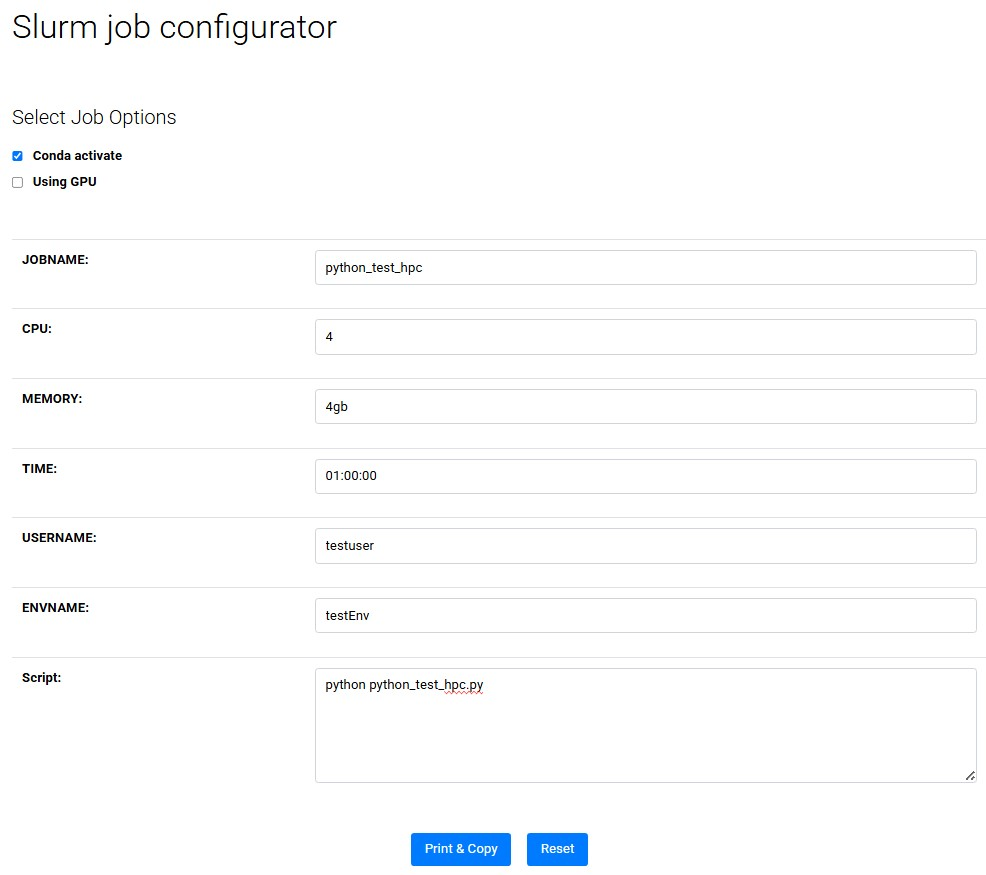

- `Conda activate`에 체크합니다.

- 빈칸들을 채웁니다. 사용 시간을 넉넉하게 입력할 것을 권장합니다.

- `Script`란에 `python xxx.py`라고 작성합니다. 이는 `home directory`에 있는 `xxx.py` 파일을 Python으로 실행하라는 의미입니다. Job script를 작성하거나 `sbatch` 명령어를 사용할 때, `visual studio code`의 explorer에서 파일명을 마우스 우클릭하고 경로 복사를 사용하면 편리합니다.

- `Print & Copy` 버튼을 누르면 내용이 클립보드에 복사됩니다.
Slurm batch script의 내용은 아래와 같습니다.

``` bash
#!/bin/bash 
#
#SBATCH --job-name=python_test_hpc
#SBATCH --partition=jobs
#SBATCH --account=testuser
#SBATCH --mem=4gb
#SBATCH --ntasks=1
#SBATCH --cpus-per-task=4
#SBATCH --time=01:00:00
#SBATCH --output=/data/home/testuser/python_test_hpc.log
#SBATCH --error=/data/home/testuser/python_test_hpc.err
#SBATCH --nodelist=hpc

CONDA_BIN_PATH=/conda/anaconda3/bin
ENV_NAME=testEnv
ENV_PATH=/data/home/testuser/.conda/envs/$ENV_NAME
source $CONDA_BIN_PATH/activate $ENV_PATH

python python_test_hpc.py
```

`python_test_hpc.job`이라는 이름으로 클러스터의 `user home directory`에 저장합니다.

Script 윗부분의 #SBATCH 옵션들의 의미는 다음과 같습니다.

- `--job-name`: 수행할 작업의 이름

- `--mem`: memory limit

- `--nodelist`: 작업할 노드의 이름

- `--ntasks`: 작업의 수

- `--cpus-per-task`: 각 작업에서 사용할 cpu 코어의 수

- `--time`: 작업 제한시간

- `--account`: 해당 작업을 수행하는 계정의 이름

- `--partition`: group of nodes with specific characteristics

- `--nodelist`: 사용할 node의 이름

- `--output`: 코드 실행 결과 log 파일. 확장자는 out이나 log가 가능합니다.

- `--error`: 코드 실행 결과 log error 파일과 log 파일의 파일명과 저장 경로는 원하는 데로 수정할 수 있습니다. sbatch에 대한 더 자세한 정보는 [Slurm 공식 웹페이지](https://slurm.schedmd.com/sbatch.html)를 참조하세요.

### Step5.4 Slurm batch script 실행

`Conda environment`를 만들 때처럼, `sbatch` 커맨드를 통해 job을 제출합니다. 할당되는 job 번호는 나중에 `squeue`를 통해 정보를 확인하거나 job을 취소할 때 이용되므로 기록해 놓아야 합니다.

Step 4에서처럼, `ctrl+shift+~`를 눌러 터미널을 여러 개 띄우고 `watch -n 10 -d squeue`로 작업 현황을 확인하고, `tail -f xxx.out`, `tail -f xxx.err`으로 콘솔 출력이나 error를 확인합니다. 작업은 4분 정도 걸립니다.

```
sbatch python_test_cpu.job
```

현재 작업이 자원을 얼마나 할당받았는지 확인하려면 다음 커맨드를 사용합니다. NumCPUs=4가 코어를 4개 할당받았다는 뜻이고, mem=4G가 RAM을 4gb 할당받았다는 뜻입니다. 이 커맨드는 다른 user가 제출한 job에 대해서도 사용할 수 있습니다.

```
scontrol show job [job number]
```

위 커맨드 실행 결과는 다음과 같습니다.

```
JobId=93 JobName=python_test_hpc
   UserId=testuser(1006) GroupId=testuser(1006) MCS_label=N/A
   Priority=4294901723 Nice=0 Account=testuser QOS=normal
   JobState=RUNNING Reason=None Dependency=(null)
   Requeue=1 Restarts=0 BatchFlag=1 Reboot=0 ExitCode=0:0
   RunTime=00:00:30 TimeLimit=01:00:00 TimeMin=N/A
   SubmitTime=2025-03-11T23:52:38 EligibleTime=2025-03-11T23:52:38
   AccrueTime=2025-03-11T23:52:38
   StartTime=2025-03-11T23:52:38 EndTime=2025-03-12T00:52:38 Deadline=N/A
   SuspendTime=None SecsPreSuspend=0 LastSchedEval=2025-03-11T23:52:38
   Partition=jobs AllocNode:Sid=hpc:410653
   ReqNodeList=hpc ExcNodeList=(null)
   NodeList=hpc
   BatchHost=hpc
   NumNodes=1 NumCPUs=4 NumTasks=1 CPUs/Task=4 ReqB:S:C:T=0:0:*:*
   TRES=cpu=4,node=1,billing=4
   Socks/Node=* NtasksPerN:B:S:C=0:0:*:* CoreSpec=*
   MinCPUsNode=4 MinMemoryNode=4G MinTmpDiskNode=0
   Features=(null) DelayBoot=00:00:00
   OverSubscribe=OK Contiguous=0 Licenses=(null) Network=(null)
   Command=/data/home/testuser/python_test_hpc.job
   WorkDir=/data/home/testuser
   StdErr=/data/home/testuser/python_test_hpc.err
   StdIn=/dev/null
   StdOut=/data/home/testuser/python_test_hpc.log
   Power=
   ```

`Visual Stuio Code`의 file explorer는 실시간으로 변화가 반영되지 않습니다. 새로고침 버튼을 눌러 주면 변화가 반영되고 output 파일이 explorer에 보입니다.

# 더 알아보기

[SLURM Job Examples](https://doc.zih.tu-dresden.de/jobs_and_resources/slurm_examples/)